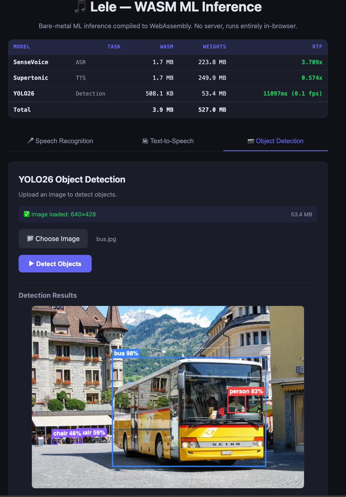

# lele: Bare-Metal Rust AI Framework

**lele** is a standalone, dependency-free inference engine for intelligence, built from scratch in pure Rust.

It rejects the "general-purpose runtime" approach (wrapping C++ libs like ORT or using heavy Torch ports) in favor of **hand-crafted, domain-specific kernels**.

## Overview

`lele` is designed to run deep learning models (specifically speech-related ones like SenseVoice, Silero VAD, and TTS, even `yolo26` ) with minimal overhead. 

## Performance Benchmarks (2026-02-12)

In-depth comparison between **lele** and **ONNX Runtime (CPU)** on macOS (Apple Silicon). All benchmarks run with single-thread affinity for fair comparison.

| Model | ORT RTF (CPU) | lele RTF | Speedup |
| :--- | :--- | :--- | :--- |
| **Silero VAD** | 0.0031 | 0.0016 | 1.93x |
| **SenseVoice** | **0.032** | 0.051 | 0.63x |
| **Supertonic** | **0.122** | 0.134 | 0.91x |
| **Yolo26** | **759.19** | 1050.56ms | 0.72x |

*Note: RTF (Real-Time Factor) is defined as (Inference Time / Audio Duration). Lower is better.*

## Key Features

- **Zero Runtime Dependencies**: Generated models are pure Rust.
- **AOT Compilation**: Converts ONNX models to specialized Rust code for maximum performance.
- **SIMD Optimized**: Hand-written kernels using Apple Silicon (NEON) and x86_64 (AVX/SSE) intrinsics.
- **Memory Efficient**: Static buffer allocation and zero-copy weight loading.
- **Speech Optimized**: Built-in feature extraction for audio (FFT, Mel-spectrogram, LFR, CMVN).
- **WebAssembly Ready**: Full browser compatibility with WASM SIMD128 optimizations.

## WebAssembly Support

**lele** compiles to WebAssembly and runs ML inference directly in the browser with **no server required**.



### WASM Performance Optimizations

| Optimization | Impact |
|--------------|--------|
| **WASM SIMD128** | Tiled matmul micro-kernel with `f32x4_mul`/`f32x4_add` (4x unroll) |
| **Optimized Activations** | SIMD paths for tanh/sigmoid/relu/silu using polynomial exp approximation |
| **Vectorized Normalization** | SIMD softmax and layer_norm with horizontal reduction |
| **Release Settings** | `opt-level=3`, `lto=true`, `codegen-units=1`, `panic="abort"` |
| **Post-Processing** | `wasm-opt -O3` for additional 5-15% size/speed gains |

**Binary Size Reduction**: Dev builds (2.9M → 1.7M for SenseVoice, 42% smaller with optimizations)

**Expected Runtime Speedup**: **20-100x** over unoptimized scalar WASM (10-50x from release mode + 2-4x from SIMD128)

### Try the Web Demo

```bash
cd examples/web-demo
./build_wasm.sh
python3 -m http.server 8080 -d web
# Open http://localhost:8080
```

See [examples/web-demo/README.md](examples/web-demo/README.md) for details.

## Supported Models

- **SenseVoiceSmall**: High-accuracy multi-lingual ASR.
- **Silero VAD**: Reliable Voice Activity Detection.
- **Supertonic**: Fast and high-quality Text-to-Speech.
- **Yolo26**: Real-time object detection.

## Getting Started

### Prerequisites

- Rust (Latest stable)
- `cargo`

### Compilation & Generation

To compile an ONNX model into Rust code:

```bash
cargo run --release --bin lele_gen -- <model.onnx> <output_path.rs>
```

### Running Examples

```bash
# SenseVoice ASR
./run_sensevoice.sh

# Supertonic TTS
./run_supertonic.sh

# Silero VAD
./run_silero.sh

# Yolo26 Object Detection
./run_yolo26.sh
```


## Roadmap

1. Performance optimizations (SIMD, multi-threading, etc.), better than ONNX Runtime.
2. Support for more audio models (e.g., Whisper, CosyVoice, etc.)
3. GPU acceleration backend (wgpu); Quantization (INT8/FP16)
4. Advanced attention mechanisms (FlashAttention, PagedAttention)
5. Voice API server (RESTful service), including ASR/TTS/Denoise endpoints.

## License

MIT
