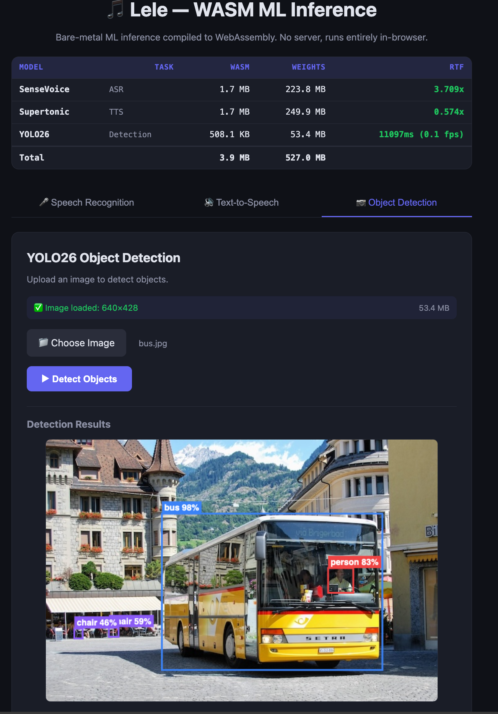

# lele: Bare-Metal Rust AI Inference Engine

**lele** is a standalone, dependency-free inference engine for ONNX models, built from scratch in pure Rust.

It rejects the "general-purpose runtime" approach (wrapping C++ libs like ORT or using heavy Torch ports) in favor of **AOT compilation** — converting ONNX graphs into specialized Rust source code with hand-crafted, domain-specific kernels.

## What Can It Do?

lele runs real-world models across **speech**, **vision**, and **text-to-speech** — all in pure Rust, on CPU, with zero runtime dependencies:

| Domain | Model | Task |
|--------|-------|------|
| **ASR** | SenseVoice Small | Multilingual speech recognition (INT8 quantized) |
| **VAD** | Silero VAD | Voice activity detection (streaming) |
| **TTS** | Supertonic 2 / 3 | Text-to-speech (5 / 31 languages, expression tags) |
| **TTS** | Hojo-TTS-Light | Bilingual ZH/EN voice-cloning TTS (0.08B Token-LM) |
| **TTS** | MOSS-TTS-Nano | End-to-end neural TTS (SDOT int8 GEMV) |
| **Vision** | Yolo26 | Real-time object detection |
| **Vision** | Yolo26n-Seg | Instance segmentation |
| **OCR** | PP-OCRv6_tiny | End-to-end text recognition (DET + REC) |

All of the above also run in the browser via WebAssembly.

## Performance (2026-06-13)

Single-threaded comparison against **ONNX Runtime (CPU)** on macOS (Apple Silicon). ORT configured with `intra_op_num_threads=1`, `inter_op_num_threads=1`. Speech models use steady-state RTF (warmup + multi-run average).

| Model | ORT | lele | Speedup |
| :--- | :--- | :--- | :--- |
| **Silero VAD** | RTF 0.002882 | RTF 0.0022 | **1.31x** |
| **SenseVoice** | RTF 0.0294 | RTF 0.0256 | **1.15x** |
| **Supertonic 2** | RTF 0.1667 | RTF 0.0550 | **3.03x** |
| **Supertonic 3** | — | RTF 0.1585 | — |
| **Yolo26** | 704.50 ms | 534.97 ms | **1.32x** |
| **Yolo26n-Seg** | 126.51 ms | 64.82 ms | **1.95x** |
| **Hojo-TTS-Light** | RTF 8.75 | RTF 6.69 | **1.31x** |
| **MOSS-TTS-Nano** | RTF 0.376 | RTF 0.293 | **1.28x** |
| **PP-OCRv6 DET** | 47.78 ms | 46.83 ms | **1.02x** |
| **PP-OCRv6 REC** | 2.94 ms/region | 2.33 ms/region | **1.26x** |

> PP-OCRv6 uses NEON depthwise convolution (4-accumulator FMA, vld2q stride-2), GELU fusion, Conv+Add(bias) fusion, and NEON reduce_mean for SE blocks.
> Hojo-TTS-Light is a 3-stage pipeline (encoder → AR-LLM → decoder); lele uses a custom KV-cache for the AR loop.
> MOSS-TTS-Nano uses SDOT int8 GEMV (137 GFLOPS on Apple M2 Pro NEON).

## Key Features

### AOT Compilation Pipeline

lele is not an interpreter. It **compiles ONNX graphs into Rust source code** at build time:

- **ONNX → Rust codegen**: Each operator becomes a direct function call with static buffer allocation. No graph traversal, no dispatch overhead at runtime.
- **Operator fusion**: 12 built-in graph patterns are detected and fused into single optimized kernels:
  - **LayerNorm**: 9-node subgraph (ReduceMean→Sub→Pow→ReduceMean→Add→Sqrt→Div→Mul→Add) → one `layer_norm` call
  - **GELU**: 5-node subgraph (Div→Erf→Add→Mul→Mul) → one `gelu` call
  - **Conv + Add(bias)**: Conv→Add → single-pass fused bias convolution
  - **Conv + SiLU**: Conv→Sigmoid→Mul → single-pass `conv2d_silu`
  - **Conv + ReLU**, **SiLU** (single / double / triple), **Linear** (MatMul→Add), **Embedding Concat**, **Quantized Linear** (6-node DynamicQuantizeLinear chain)
- **Constant folding**: Shape, Unsqueeze, Squeeze, Concat, Slice, Cast, and ConstantOfShape with all-constant inputs are evaluated at compile time and removed from the graph.
- **Buffer allocation**: Liveness analysis assigns each tensor to a reusable workspace buffer with zero-copy aliasing for Reshape/Squeeze/Unsqueeze/Identity/Cast.
- **Weight deduplication**: Identical initializers share a single offset in the binary blob.

### Extensible Compiler API

The `Compiler` builder lets you customize code generation for any model:

```rust
use lele::compiler::Compiler;

let compiler = Compiler::new()
    .with_name("MyModel")           // Set generated struct name
    .with_default_optimizations()   // Load fusion patterns + helper methods
    .with_constant_folding(true)    // Enable compile-time folding
    .with_override("MyCustomOp", |node, inputs, outputs, buf, w, indent| {
        // Generate custom Rust code for any operator
        Ok(())
    })
    .with_pattern("MyFusion", my_matcher, my_generator);  // Custom fusion
```

### Runtime / Compiler Split

The `compiler` feature is optional (`default = ["compiler"]`). For deployment, you can depend on lele with `default-features = false` and ship **only the generated Rust code + weights binary** — no protobuf parser, no ONNX dependency, no overhead.

### SIMD-Optimized Kernels

- **AArch64 (NEON)**: Hand-written intrinsics for matmul, convolution, activations, normalization. Includes specialized depthwise convolution (4-accumulator FMA latency hiding, `vld2q` stride-2 decimation), per-channel broadcast add/mul for SE blocks, NEON reduce_mean, and **SDOT/I8MM** int8 GEMV for quantized inference.
- **x86_64 (AVX2/FMA)**: SIMD paths for GEMM, convolution, LSTM/GRU gates, normalization.
- **WASM (SIMD128)**: Tiled matmul micro-kernel with `f32x4` 4× blocking, SIMD activations.
- **Apple Accelerate**: Optional `cblas_sgemm` FFI for AMX-accelerated GEMM.

### Advanced Kernel Capabilities

- **INT8 quantization**: DynamicQuantizeLinear, MatMulInteger, fused quantized linear with pre-packed weights
- **FP16 weights**: f16 weight inference with dedicated GEMV kernel
- **Recurrent**: LSTM and GRU with SIMD gate kernels
- **Autoregressive KV-cache**: Custom cache for AR-LLM generation (used in Hojo-TTS)
- **STFT**: Built-in Short-Time Fourier Transform for audio processing

### Audio Feature Extraction

Built-in DSP frontend for speech models:

- **FFT**: Radix-2 real FFT with precomputed twiddle factors
- **Mel spectrogram**: HTK mel scale with sparse filterbank (only nonzero weights stored)
- **LFR**: Low Frame Rate stacking (reduces frame rate by N×)
- **CMVN**: Cepstral Mean-Variance Normalization
- **Integrated pipeline**: `SenseVoiceFrontend` — scale → pre-emphasis → Hann window → FFT → mel → log → LFR

### WebAssembly Support

lele compiles to WASM and runs ML inference directly in the browser with no server required.

The web demo includes **ASR, TTS, object detection, and instance segmentation** — all client-side.



| Optimization | Impact |
|---|---|
| WASM SIMD128 | Tiled matmul with `f32x4` (4x unroll) |
| Optimized Activations | SIMD paths for tanh/sigmoid/relu/silu |
| Release Settings | `opt-level=3`, `lto=true`, `codegen-units=1`, `panic="abort"` |
| Post-Processing | `wasm-opt -O3` for 5-15% size/speed gains |

```bash
cd examples/web-demo
./build_wasm.sh
python3 -m http.server 8080 -d web
# Open http://localhost:8080
```

See [examples/web-demo/README.md](examples/web-demo/README.md) for details.

## Supported ONNX Operators

**60+ operators** across all categories:

- **Math**: Add, Sub, Mul, Div, Mod, Pow, Sqrt, Neg, Exp, Log, Sin, Cos, Erf, Softplus, Clip, Round, Floor, Ceil, Reciprocal, CumSum, Max, Range, Einsum (partial)
- **Neural Network**: Conv, ConvTranspose, ConvInteger, Gemm, MatMul, MatMulInteger, LSTM, GRU, BatchNormalization, LayerNormalization, MaxPool, AveragePool, GlobalAveragePool, Resize
- **Activation**: Relu, LeakyRelu, Sigmoid, Tanh, Softmax, PRelu, HardSigmoid, ArgMax
- **Tensor**: Reshape, Transpose, Concat, Split, Slice, Gather, GatherElements, Pad, Expand, Tile, Where, TopK, Flatten, Squeeze, Unsqueeze
- **Reduction**: ReduceSum, ReduceMean, ReduceMax, ReduceL2
- **Comparison**: Equal, Less, Greater, LessOrEqual, GreaterOrEqual, And, Or, Xor, Not
- **Control Flow**: If (then/else subgraph recursion)
- **Signal**: STFT
- **Other**: Shape, Size, Cast, ConstantOfShape, DynamicQuantizeLinear, Identity, Constant

Silu is available as a fused pattern (Sigmoid→Mul). GELU is fused via compiler pattern (Div→Erf→Add→Mul→Mul).

## Getting Started

### Prerequisites

- Rust (latest stable)
- `cargo`

### Option 1: CLI Codegen

Convert an ONNX model into Rust source code:

```bash
cargo run --release --bin lele_gen -- <model.onnx> <output.rs>
```

This produces `<output.rs>` (the model code) and `<output>_weights.bin` (the weights).

### Option 2: Build-Script Integration (`lele-build`)

For a seamless build workflow, use the `lele-build` crate in your `build.rs`. It supports model download from **Hugging Face Hub**, **URL**, or **local path**, with caching and automatic regeneration:

```toml
# model.toml
[model]
source = "hf-hub"
repo = "your-org/your-model"
files = [{ file = "model.onnx" }]

[codegen]
class_name = "MyModel"
```

```rust
// build.rs
use lele_build::{config::ModelConfig, *};

fn main() {
    let cfg = ModelConfig::load("model.toml").unwrap();
    if need_regenerate_with_model("MyModel", "src/gen", "model.toml", None) {
        // Download + generate
    }
}
```

Set `HF_ENDPOINT` to use a mirror. Set `LELE_SKIP_MODEL_GEN=1` to skip generation. If download fails, a compiling stub is generated so `cargo build` always succeeds.

### Running Examples

```bash
./run_sensevoice.sh          # SenseVoice ASR
./run_silero.sh              # Silero VAD
./run_supertonic.sh          # Supertonic 2 TTS (5 languages)
./run_supertonic3.sh         # Supertonic 3 TTS (31 languages)
./run_yolo26.sh              # Yolo26 object detection
./run_yolo26n_seg.sh         # Yolo26n-Seg instance segmentation
./run_hojo_tts.sh "text"     # Hojo-TTS-Light voice cloning
cd examples/moss-tts-nano && cargo run --release -- "text"  # MOSS-TTS-Nano
cd examples/ppocr && cargo run --release -- image.png      # PP-OCRv6 OCR
```

## Supported Models

| Model | Type | Details |
|-------|------|---------|
| **SenseVoiceSmall** | ASR | Multilingual speech recognition |
| **Silero VAD** | VAD | Streaming voice activity detection |
| **Supertonic 2** | TTS | 5 languages |
| **Supertonic 3** | TTS | 31 languages, expression tags (`<laugh>`, `<breath>`, `<sigh>`) |
| **Hojo-TTS-Light** | TTS | 0.08B bilingual ZH/EN, voice cloning (encoder → AR-LLM → decoder) |
| **MOSS-TTS-Nano** | TTS | End-to-end neural TTS with int8 GEMV |
| **Yolo26** | Vision | Real-time object detection |
| **Yolo26n-Seg** | Vision | Instance segmentation |
| **PP-OCRv6_tiny** | OCR | End-to-end text recognition (DET + REC pipeline) |

## Architecture

```
ONNX Model
    │
    ▼
┌──────────────┐     ┌───────────────────────┐
│  lele-build  │────▶│      Compiler         │
│ (download,   │     │  ┌─────────────────┐  │
│  cache)      │     │  │ Constant Fold   │  │
└──────────────┘     │  │ Pattern Fusion  │  │
                     │  │ Buffer Alloc    │  │
                     │  │ Code Gen        │  │
                     │  └─────────────────┘  │
                     └──────────┬────────────┘
                                │
                    ┌───────────▼───────────┐
                    │  model.rs + .bin      │
                    │  (pure Rust, no deps) │
                    └───────────┬───────────┘
                                │
              ┌─────────────────┼─────────────────┐
              ▼                 ▼                  ▼
        Native (NEON/AVX)   WASM (SIMD128)   Embedded
```

## Roadmap

1. **Broader operator coverage** — support as many ONNX operators as possible so any model "just works"
2. **CPU-first performance** — push SIMD (NEON/AVX/WASM) and multi-threading to be the fastest CPU inference engine
3. **Lightweight & edge** — stay zero-dependency, minimal binary size, ideal for embedded and resource-constrained devices
4. **More models** — Whisper, CosyVoice, and other popular edge-friendly models
5. **Advanced techniques** — FlashAttention, PagedAttention for long-sequence efficiency (still CPU)
6. **Voice API server** — RESTful ASR/TTS/Denoise endpoints for edge deployment

## License

MIT
